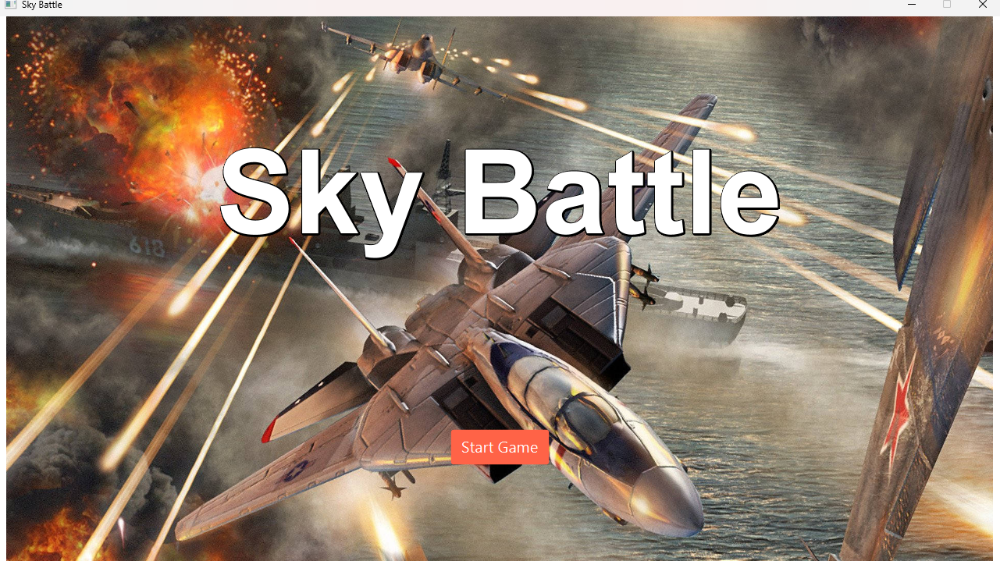
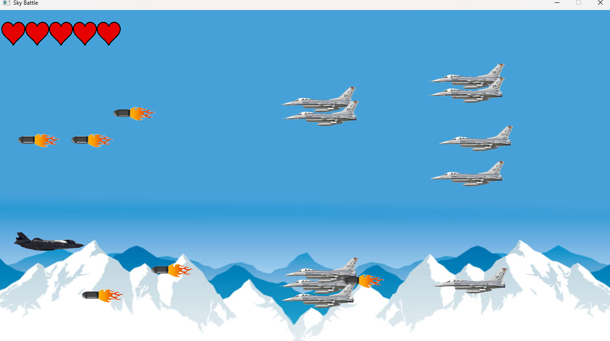

# Table of Contents
Note
- I committed all my files at the submission date to prevent plagiarism and cloned by the others.

---
- [GitHub](#github)
- [Compilation Instructions](#compilation-instructions)
- [Implemented and Working Properly](#implemented-and-working-properly)
- [Implemented but Not Working Properly](#implemented-but-not-working-properly)
- [Features Not Implemented](#features-not-implemented)
- [New Java Classes](#new-java-classes)
- [Modified Java Classes](#modified-java-classes)
- [Unexpected Problems](#unexpected-problems)

## GitHub

---
**Name:** Siddharth Ganeson <br>
**Student ID:** 20493806 <br>
**Link:** https://github.com/DutchLady04/CW2024.git

## Compilation Instructions
[Back to Table of Contents](#table-of-contents)

---

### 1. Check if you have installed JDK 21 or later
- Currently, Oracle offers JDK 21 or later for installation.
- JDK 23 is preferred
- You can find the download link here:
  https://www.oracle.com/cis/java/technologies/downloads/#jdk23-windows

- Verify your JDK version:
    ```bash
    java -version
    ```

### 2. Make sure you have installed JavaFX ver 21 and above
- Ensure that you are at least using JDK 17 or above as only those versions can support JavaFX 21++.
- You can find the download link here:
  https://gluonhq.com/products/javafx/

### 3. Install IntelliJ IDEA Community Edition 2023.3.4
- IntelliJ IDEA Community Edition was used as the IDE to refactor this project. Install 2023.3.4 or above to avoid any unexpected problems.
- You can download it here (make sure to download the community edition):
  https://www.jetbrains.com/idea/download/?section=windows

### 4. Install Git
- Windows: Download and install from [Git for Windows](https://gitforwindows.org/)
- macOS: Install via Homebrew: `brew install git`
- Linux: `sudo apt-get install git` (Ubuntu/Debian) or `sudo dnf install git` (Fedora)
- Verify installation:
  ```bash
  git --version
  ```

### 5. Clone the Repository
- Navigate a green button <> Code in github
- Copy the GitHub repository URL or Download ZIP
- Select "Clone Repository" in Intellij
- Paste the URL from earlier into the URL field in Repository URL
- Click "Clone", and IntelliJ will clone and open the repository.


### 6. Make sure that the compiler is running on JDK 22
- Go to `File` > `Project Structure` > `Project`.
- Set the `Project SDK` to JDK 22.
-  Go to `File` > `Settings` > `Build, Execution, Deployment` > `Compiler` > `Java Compiler`.
- Set the `Target bytecode version` to 22.


### 7. Make sure that all dependencies in pom.xml are added and up to 22
- Open your `pom.xml` file.
- Ensure the `maven.compiler.source` and `maven.compiler.target` properties are set to 22:
    ```xml
    <properties>
        <maven.compiler.source>22</maven.compiler.source>
        <maven.compiler.target>22</maven.compiler.target>
    </properties>
    ```
- Add and update dependencies to be compatible with JDK 22.
  ```xml
  <dependencies>
      <dependency>
          <groupId>org.openjfx</groupId>
          <artifactId>javafx-controls</artifactId>
          <version>20.0.2</version>
      </dependency>
      <dependency>
          <groupId>org.openjfx</groupId>
          <artifactId>javafx-fxml</artifactId>
          <version>20.0.1</version>
      </dependency>
      <dependency>
          <groupId>org.openjfx</groupId>
          <artifactId>javafx-media</artifactId>
          <version>20.0.1</version>
      </dependency>
      <!-- Add other dependencies here -->
  </dependencies>
  ```

### 8. Install dependencies
- Ensure you have Maven installed. Then, run:
  ```bash
  mvn clean install
  ```

### 9. Run the application
- to compile and run your JavaFX application
  ```bash
  mvn javafx:run
  ```
### 10. Run the Main.java file to start the game
- It is located in /src/main/java/com/example/demo/controller/Main.java
- You can click on the green play button on the top right of the screen to run the game.


## Implemented and Working Properly
[Back to Table of Contents](#table-of-contents)

---

### <ins>1. Main Menu</ins>
- Displaying main menu in game with **start game** button to allow players time to get ready to play instead of just jumping right into the game
  

### **Start Game**
- Upon selection, it will proceed to level one.

### <ins>4. New Level</ins>
- Introduced a new level called LevelOneHalf.java.
- This level is slightly more challenging than Level One but less difficult than Level Two (boss level).
- Features include increased spawn rates for enemies, increased fire rates for enemies and increased kill count needed to proceed to the next level.
  

## Implemented but Not Working Properly
[Back to Table of Contents](#table-of-contents)

---

### Not Applicable (N/A)
- All implemented features are working properly to prevent errors and warnings.


## Features Not Implemented
[Back to Table of Contents](#table-of-contents)


### <ins>1. Sound Effect and Music Background</ins>
- The sound effect for the player's plane shooting projectiles has not been implemented.
- The sound effect for clicking buttons has not been implemented.
- The sound effect for defeating enemies or bosses and for the player's plane has not been implemented.
- The background music is static, only playing one track instead of changing with the levels.

### <ins>2. Power Ups</ins>
- Power-ups for upgrading bullets (e.g., increasing shooting speed or firing multiple lines) have not been implemented.
- The ability to collect hearts for reviving lost hearts has not been implemented.

### <ins>3. Self-Changeable Key Bindings</ins>
- Unable to change the control keys.
- The control key changes are not saved during gameplay.
- When exiting the game, the control keys retain the previous changes instead of resetting to the default.

### <ins>4. Enemy and Boss Attack Patterns</ins>
- Currently, the enemies and bosses in the game are boring, as they only shoot one type of projectile.
- Their movement is somewhat predictable, making the game less challenging.
- The boss is too easy, as it only shoots one type of projectile. It would be more engaging to add varied attack patterns, such as lasers, to increase the difficulty.

### <ins>5. Game Objectives</ins>
- The game objectives are not displayed during the levels, making it unclear to the player when or how they win.
- The player is unable to plan tactics while playing the game.
- For example, the player should know how many enemies need to be defeated to proceed to the next level, or how many waves they must survive to progress

### <ins>6. Health Bars</ins>
- A health bar should be displayed for enemies and bosses, as players are unaware of their initial health and the number of projectiles needed to defeat them.
- This would allow players to easily track the health of enemies and bosses, enhancing the gameplay experience.

### <ins>7. Background Music</ins>
- Background music in the game to enhance engagement and reduce monotony was not implemented.

### <ins>8. i-Frames</ins>
- The user plane will blink for 1.5 seconds when it takes damage
- Colliding with an enemy during the invincibility frames will destroy the enemy.
- During the blinking phase, it becomes invincible for a 1.5 seconds to prevent losing hearts too quickly.
- None of these features were implemented

### <ins>9. New Enemy Types</ins>
- Features a new enemy with a hit point pool and an increased fire rate.
- This feature was not implemented.


### <ins>10. Pause Menu</ins>
- Pressing the 'Esc' key pauses the game and displays a pause menu with the following options: **Resume**, **Restart**,  **Main Menu**, and **Exit**.
- Players can pause the game to take a break and continue when ready.
- When the game is paused, a dark overlay will appear on the screen to make the pause menu stand out .


### <ins>11. Added Game Over and Win Screens/ins>
- Each level now includes a Game Over screen with options to return to the main menu or restart the level.
- A Win screen has been added to each level, featuring options to return to the main menu or proceed to the next level.
- None of these feature were implemented.


## New Java Classes
[Back to Table of Contents](#table-of-contents)


### 1.. LevelOneHalf.java
#### (com/example/demo/LevelOneHalf.java)
- The boss level is currently level 2, so the level added in between was named LevelOneHalf.


### 2. MainMenu.java
#### (com/example/demo/Screen/MainMenu.java)
- Display options to start the game.
- Introduce the game to give players an overview before starting.


## Modified Java Classes
[Back to Table of Contents](#table-of-contents)


## Unexpected Problems
[Back to Table of Contents](#table-of-contents)

---
### 1. Multiple Pop-Ups
- At the start, gotoNextLevel() did not properly handle the clearing of assets, which caused the game to crash and led to an excessive number of pop-ups, eventually crashing the PC.
  To resolve this, timeline.stop() was added to halt active timelines before proceeding to the next level.


### 2. Level Transition Error
- When creating LevelOneHalf, I did change the goToNextLevel method in Level One to go to Level One Half.
- Hence, the game kept crashing when i ran it.
- To resolve this, the goToNextLevel method was changed to go to Level One Half and then to Level Two.

  